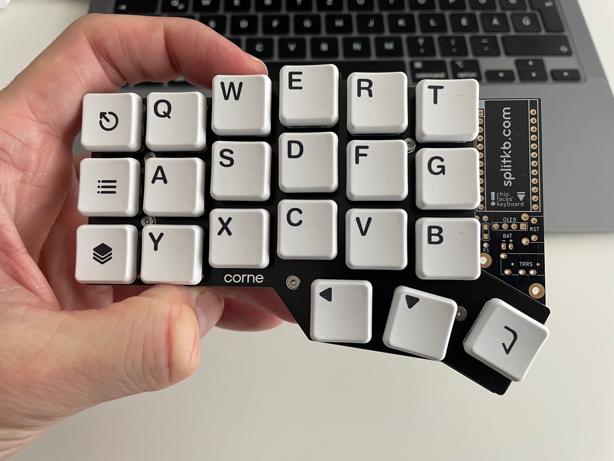

# Building a (wireless) corne
Building a corne keyboard involves assembling the fundamental components that make up a functional keyboard.  
This repo is a basic guide how I did it, and contains the files for my zmk keymap.  

## What you need to buy
- [x] PCB (Printed Circuit Board): This is the brain of the keyboard, connecting the switches and managing keypress signals.
- [x] Switches: Choose mechanical switches based on your preference (Cherry MX, Gateron, etc.). These are the keys that register keypresses.
- [x] Keycaps: These are the physical keys you press. Make sure they are compatible with your chosen switches.
⌛ Microcontroller: As my goal was to go wireless, currently the only option is the nicenano chip. Order how swap sockets as well.
- [x] Diodes: Solder diodes to prevent key ghosting and ensure accurate input.
- [x] Plate: A plate can be used to hold switches in place and provide stability.
- [x] Case: Plenty of options, currently just a plate, but later I would like to have a 3D printed one.
- [x] Stabilizers: If you're building a larger keyboard or using certain key layouts, you'll need stabilizers for larger keys like Enter, Shift, and Spacebar, as I only have 1U keys, not needed for his build.
- [x] Soldering Iron and Solder: For soldering switches and other components to the PCB.
⌛ Layout design: You can program any keystroke anywhere as you want to.
⌛ Battery: To be truly wireless.
 

## Base steps

⌛ Layout Planning: Decide on your keyboard layout and ensure all components are compatible.
- [ ] Soldering: Solder the diodes to the PCB, followed by the switches. Make sure to solder carefully and avoid cold joints.
- [ ] Attach Microcontroller: Connect the microcontroller to the PCB, ensuring it has the necessary firmware.
- [ ] Programming: Program your microcontroller to recognize keypresses and assign functions to each key.
- [ ] Assembling the Case: Place the PCB into the case, securing it in place. If using a plate, attach switches to it before placing it in the case.
- [ ] Keycaps: Place keycaps on the switches, ensuring they are aligned correctly.
- [ ] Testing: Test each key to ensure it registers correctly. Fix any issues that arise.
- [ ] Final Assembly: Close the case, securing all components in place.

Currently some parts missing, so I'm waiting for that, meanwhile assembled just to see how it will look:

